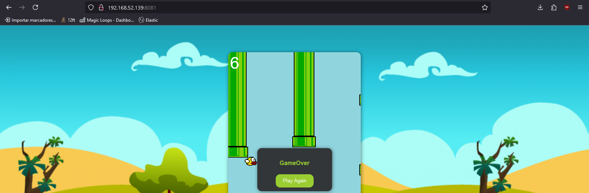

# Funcionamiento

Primero vamos a desplegar un deployment y a este le adjuntaremos los diferentes services.
~~~sh
kubectl apply -f 00-nginx-game.yaml
~~~

Revisamos el estado de los servicess
~~~
NAME                 TYPE           CLUSTER-IP      EXTERNAL-IP   PORT(S)          AGE
kubernetes           ClusterIP      10.96.0.1       <none>        443/TCP          2m10s
nginx-clusterip      ClusterIP      10.102.71.46    <none>        80/TCP           21s
nginx-loadbalancer   LoadBalancer   10.111.42.156   10.111.42.156 8082:32125/TCP   21s
nginx-nodeport       NodePort       10.98.11.215    <none>        8081:30001/TCP   21s
~~~

Ahora expondremos el servicio de cluster ip para comprobar su funcionamiento.
~~~sh
kubectl port-forward --address 0.0.0.0 service/nginx-clusterip 8080:80
~~~
Ahora desde nuestro navegador accedemos a la direccion de la maquina virtual http://192.168.52.139:8080 

Incluso podremos establecer la conexion de los servicios y al asignarle puertos diferentes podran interactuar mostrando el acceso.
~~~sh
kubectl port-forward --address 0.0.0.0 service/nginx-nodeport 8081
~~~

~~~sh
kubectl port-forward --address 0.0.0.0 service/nginx-loadbalancer 8082
~~~

Como tenemos el cluster corriendo en una maquina virtual con direccion 192.168.52.139 haremos lo siguiente
Para poder utilizar el formato loadbalancer activaremos el plugin siguiente y lo dejarmos corriendo en una terminal.
~~~sh
minikube tunnel
~~~
Esto nos asignara una ip de su red interna
Para acceder al NodePort primero tendremos que saber la direccion de minikube
~~~sh
minikube ip
192.168.49.2
~~~
Con esta direccion crearemos una redireccion para poder entrar desde nuestra maquina local.

Vamos a permitir que las interfaces de red se comuniquen entre la maquina virtual y minikube.
~~~sh
sudo iptables -A FORWARD -i ens33 -o br-a0cb10e18c04 -j ACCEPT
sudo iptables -A FORWARD -i br-a0cb10e18c04 -o ens33 -m state --state ESTABLISHED,RELATED -j ACCEPT
~~~
Ahora establecemos la redireccion para NodePort expone el puerto 30001 quedaria de esta manera
~~~sh
sudo iptables -t nat -A PREROUTING -p tcp -d 192.168.52.139 --dport 30001 -j DNAT --to-destination 192.168.49.2:30001
sudo iptables -t nat -A POSTROUTING -j MASQUERADE
~~~
Ahora desde nuestro navegador accedemos a la direccion de la maquina virtual http://192.168.52.139:30001

Para comprobar el funcionamiento del LoadBalancer agregaremos la siguiente regla:
Aqui vamos a acceder atravez de su direccion ip externa solo accederemos desde el puerto 32125 para mostrar todos los servicios funcionando y que no se traslape con el port-forward 8082
~~~sh
sudo iptables -t nat -A PREROUTING -p tcp -d 192.168.52.139 --dport 32125 -j DNAT --to-destination 10.111.42.156:8082
~~~
http://192.168.52.139:32125

sudo iptables -t nat -A PREROUTING -p tcp -d 192.168.52.139 --dport 30001 -j DNAT --to-destination 192.168.49.2:30001
sudo iptables -t nat -A PREROUTING -p tcp -d 192.168.52.139 --dport 32125 -j DNAT --to-destination 192.168.49.2:32125

Chain FORWARD (policy DROP 94 packets, 4888 bytes)
num   pkts bytes target     prot opt in     out     source               destination
11      15   780 ACCEPT     all  --  ens33  br-a0cb10e18c04  0.0.0.0/0            0.0.0.0/0
12       0     0 ACCEPT     all  --  br-a0cb10e18c04 ens33   0.0.0.0/0            0.0.0.0/0            state RELATED,ESTABLISHED