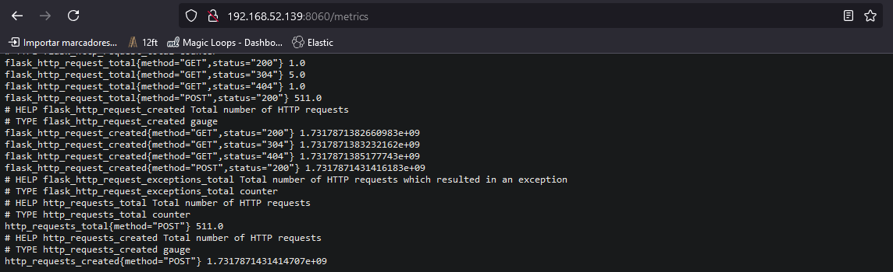

# Proceso de Instalacion

## Paso 1. Instalar Metrics-Server en EKS
Implemente el servidor de métricas con el siguiente comando:
~~~sh
kubectl apply -f https://github.com/kubernetes-sigs/metrics-server/releases/latest/download/components.yaml
~~~
Compruebe que la implementación de metrics-server está ejecutando la cantidad deseada de Pods con el siguiente comando:
~~~sh
kubectl get deployment metrics-server -n kube-system
~~~
Para probar si el servidor de métricas funciona, muestre el uso de recursos (CPU/memoria) de los nodos.
~~~sh
kubectl top nodes

NAME                          CPU(cores)   CPU%   MEMORY(bytes)   MEMORY%
ip-10-10-1-154.ec2.internal   47m          2%     481Mi           14%
ip-10-10-2-104.ec2.internal   27m          1%     704Mi           21%
~~~
## Paso 2. Instalar Prometheus
Entorno de Prueba:

~~~yml
Minikube: v1.32.0
ClusterEKS: v1.31.0
kubernetes: v1.31.0
Grafana: 11.2.1
Prometheus: 65.1.0
Prometheus-adapter: v0.12.0
~~~
Si se prueba en un Cluster EKS (omita este apartado de Minikube)
~~~sh
minikube start --cpus=4 --memory=8000 --kubernetes-version=v1.31.0
minikube addons enable metrics-server
~~~
Instalacion Helm
~~~bash
# install requirements
curl https://baltocdn.com/helm/signing.asc | gpg --dearmor | sudo tee /usr/share/keyrings/helm.gpg > /dev/null
sudo apt-get install apt-transport-https --yes
# agregar el repo
echo "deb [arch=$(dpkg --print-architecture) signed-by=/usr/share/keyrings/helm.gpg] https://baltocdn.com/helm/stable/debian/ all main" | sudo tee /etc/apt/sources.list.d/helm-stable-debian.list
# actualizar e instalar
sudo apt-get update
sudo apt-get install helm
~~~
Creamos el siguiente archivo para instalar Grafana-Prometheus
~~~yaml   01_prom_values.yaml
defaultRules:
  rules:
    etcd: false
kubeControllerManager:
  enabled: false
kubeEtcd:
  enabled: false
kubeScheduler:
  enabled: false
grafana:
  image:
    tag: 11.2.1
  adminPassword: test123
~~~
Añadimos los repositorios de prometheus
~~~sh
helm repo add prometheus-community \
https://prometheus-community.github.io/helm-charts
helm repo update
~~~
Instalamos prometheus operator
~~~sh
helm install monitoring \
prometheus-community/kube-prometheus-stack \
--values 01_prom_values.yaml \
--version 65.1.0  \
--namespace monitoring \
--create-namespace
~~~
Revisamos que esten funcionando los servicios.
~~~sh
watch kubectl get pods -n monitoring
kubectl get svc -n monitoring
~~~
~~~sh
kubectl port-forward --address 0.0.0.0 \
svc/monitoring-kube-prometheus-prometheus 9090 \
-n monitoring
~~~
## 3. Desplegamos nuestro Deployment fibonacci
 
~~~sh
kubectl apply -f 03_fibonacci.yaml
~~~
Exponer el servicio
~~~sh
kubectl port-forward --address 0.0.0.0 \
svc/fibonacci-svc 8060
~~~
La configuracion del service monitor es igual a configurar scrapconfig para recibir metricas de un servicio es necesario desplegarla para que prometheus reciba las metricas.(Se instala con el arhivo 03_fibonacci.yaml)
~~~yaml
apiVersion: monitoring.coreos.com/v1
kind: ServiceMonitor
metadata:
  labels:
    app: kube-prometheus-stack-operator #debe macherar con las etiquetas del servicio levantado
    release: monitoring
    app.kubernetes.io/name: fibonacci  # Puedes agregar etiquetas adicionales
  name: fibonacci-app
  namespace: monitoring  # Asegúrate de estar en el mismo namespace del operador
spec:
  namespaceSelector:
    matchNames:
      - default  # El namespace donde está tu Service de Fibonacci
  endpoints:
  - interval: 10s
    port: http  # Asegúrate de que este puerto sea el correcto
  selector:
    matchLabels:
      app: fibonacci
~~~

## 2. Instalar Prometheus Adapter
Para que las métricas de Prometheus se usen en un Horizontal Pod Autoscaler (HPA), debes configurar un adaptador de métricas para que Kubernetes pueda interpretar las métricas de Prometheus. Aquí se hace mediante el uso de kube-prometheus-stack junto con un adaptador de métricas compatible, como el Prometheus Adapter.

~~~sh
helm repo add prometheus-community https://prometheus-community.github.io/helm-charts
helm repo update
~~~
Creamos el archivo values: 02_adapter_values.yaml
~~~yaml   02_adapter_values.yaml
rules:
  rules:
    - seriesQuery: 'flask_http_request_total{namespace!="",pod!=""}'
      resources:
        overrides:
          namespace:
            resource: namespace
          pod:
            resource: pod
      name:
        matches: "^(.*)_total"
        as: "http_request_total"
      metricsQuery: 'sum(rate(flask_http_request_total{<<.LabelMatchers>>}[2m])) by (namespace, pod)'
~~~
Instalamos prometheus adapter
~~~sh
helm install prometheus-adapter \
prometheus-community/prometheus-adapter \
--set prometheus.url="http://monitoring-kube-prometheus-prometheus.monitoring.svc" \
--set prometheus.port="9090" \
--set rbac.create="true" \
--namespace monitoring  \
--set image.tag="v0.12.0" \
--values 02_adapter_values.yaml
~~~
Verificar el funcionamiento y recoleccion de metricas

## Metrica personalizada
Las metricas personalizadas las creamos configurando el archivo 02_adapter_values.yaml

La app fibonacci expone las metricas en el path /metrics
y la metrica que tomamos en cuenta va ser el numero de solicitudes POST quer recibe el Pod.
Los datos que tomamos de la aplicacion fibonacci en su path /metrics es:
- flask_http_request_total

Ahora nuestra metrica personalizada nos dara la suma de solicitudes que tiene en un lapso de 2m, y le asignaremos un nombre:
- http_request_total

~~~yaml
rules:
  rules:
    - seriesQuery: 'flask_http_request_total{namespace!="",pod!=""}'
      resources:
        overrides:
          namespace:
            resource: namespace
          pod:
            resource: pod
      name:
        matches: "^(.*)_total"
        as: "http_request_total"
      metricsQuery: 'sum(rate(flask_http_request_total{<<.LabelMatchers>>}[2m])) by (namespace, pod)'
~~~

Dependiendo como configuremos el hpa sera el disparador.
Prometheus-Adapter en su instalacion Helm, no toma el nombre como tal que declaramos en el campo:
~~~yaml
        as: "http_request_total"
~~~
Pero dado el nombre que asignamos nosotros, buscariamos el nombre asignado por prometheus adapter, para buscar el nombre que sera puesto en el archivo HPA, tomamos la primera parte de la consulta, cruzarla con los siguientes comandos:

~~~sh
kubectl get --raw "/apis/custom.metrics.k8s.io/v1beta1/" | jq | grep http_request

# Con el siguiente comando nos aseguramos que la metrica este dirigida al pod que tiene esas metricas, revisar el namespace donde se despliega en mi caso "namespaces/default"
kubectl get --raw "/apis/custom.metrics.k8s.io/v1beta1/namespaces/default/pods/*/http_requests"
# Dandonos la confirmacion que esa es la metrica correcta: "name":"fibonacci-fc48bf964-tvclt",
{"kind":"MetricValueList","apiVersion":"custom.metrics.k8s.io/v1beta1","metadata":{},"items":[{"describedObject":{"kind":"Pod","namespace":"default","name":"fibonacci-fc48bf964-tvclt","apiVersion":"/v1"},"metricName":"http_requests","timestamp":"2024-11-09T21:40:39Z","value":"0","selector":null}]}
~~~

## Instalar VPA
Instalar los recursos para desplegar VPA

Compatibilidad:
- Versión VPA: 1.2.1

Para instalar VPA, descargue el código fuente de VPA y ejecute el siguiente comando dentro del directorio:
~~~sh
git clone https://github.com/kubernetes/autoscaler.git
cd autoscaler/vertical-pod-autoscaler/hack
./vpa-up.sh
# Desisnstalar ./vpa-down.sh
~~~
Para ver que el servico esta activo ejecutamos el comando:
~~~sh
kubectl get crds | grep verticalpodautoscalers
# RESULTADO
verticalpodautoscalers.autoscaling.k8s.io             2024-11-08T23:12:48Z
~~~
**Con esto el entorno ya se encuentra listo para hacer las pruebas.**
