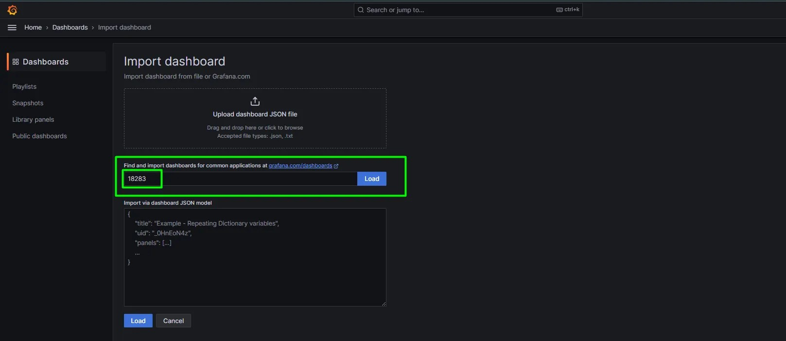

# Monitorear Cluster de Kubernetes con Prometheus y Grafana

Entorno

~~~yml
Minikube: v1.32.0
kubernetes: v1.30.0
Grafana: 11.2.1
Prometheus: 65.1.0 
~~~
Instalacion en Minikube
~~~sh
minikube start --cpus=2 --memory=6000 --kubernetes-version=v1.30.0
minikube addons enable metrics-server
~~~
Instalacion Helm

~~~bash
# install requirements
curl https://baltocdn.com/helm/signing.asc | gpg --dearmor | sudo tee /usr/share/keyrings/helm.gpg > /dev/null
sudo apt-get install apt-transport-https --yes
# agregar el repo
echo "deb [arch=$(dpkg --print-architecture) signed-by=/usr/share/keyrings/helm.gpg] https://baltocdn.com/helm/stable/debian/ all main" | sudo tee /etc/apt/sources.list.d/helm-stable-debian.list
# actualizar e instalar
sudo apt-get update
sudo apt-get install helm
~~~

Instalacion prometheus
Creamos el siguiente archivo para configurar grafana-prometheus

~~~yaml   prometheus-values.yaml
grafana:
  image:
    tag: 11.2.1
  adminPassword: test123
~~~

Añadimos los repositorios de prometheus

~~~sh
helm repo add prometheus-community \
https://prometheus-community.github.io/helm-charts
helm repo update
~~~

Instalamos prometheus operator

~~~sh
helm install monitoring \
prometheus-community/kube-prometheus-stack \
--values prometheus-values.yaml \
--version 65.1.0  \
--namespace monitoring \
--create-namespace
~~~

Revisamos que esten funcionando los servicios.

~~~sh
kubectl get pods -n monitoring
kubectl get svc -n monitoring
~~~

~~~sh
kubectl port-forward --address 0.0.0.0 \
svc/monitoring-kube-prometheus-prometheus 9090 \
-n monitoring
~~~

~~~sh
kubectl port-forward --address 0.0.0.0 \
svc/monitoring-grafana 3000:80 \
-n monitoring 
~~~

 Podemos tomar como base alguna de las tantas plantillas que fueron publicadas y compartidas por la comunidad, para acceder a ellos solo debemos acceder al siguiente enlace:

<https://grafana.com/grafana/dashboards/?source=post_page-----d6ffb620d265-------------------------------->

Podemos elegir cualquiera, el que más te guste y solo debes copiar el ID para luego importarlo en grafana. Por ejemplo, voy a elegir el siguiente: Kubernetes Dashboard
id

~~~sh
18283
~~~

Para importar en grafana solo debes seguir los siguientes pasos, debes tener a mano el ID y el nombre del datasource de Prometheus.

Y listo, con pasos tan simples ya tienes tu primer dashboard creado! Puedes observar distintas métricas de recursos del Cluster, CPU, Memoria, Pods en ejecución, etc.
