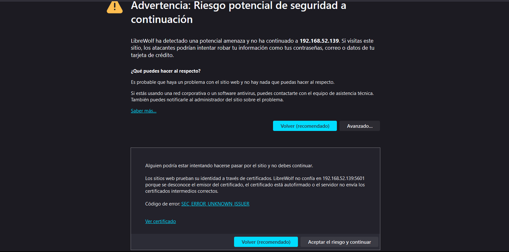
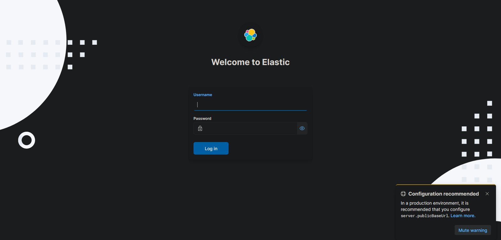
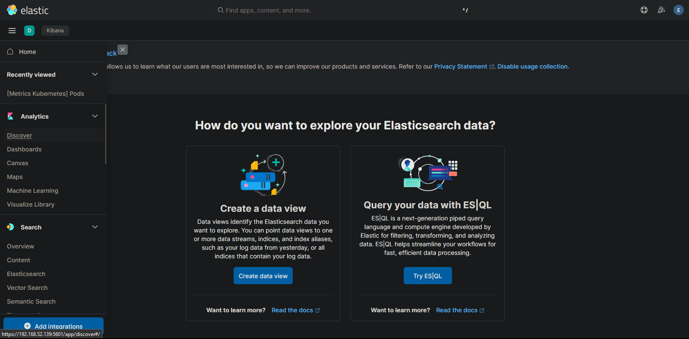
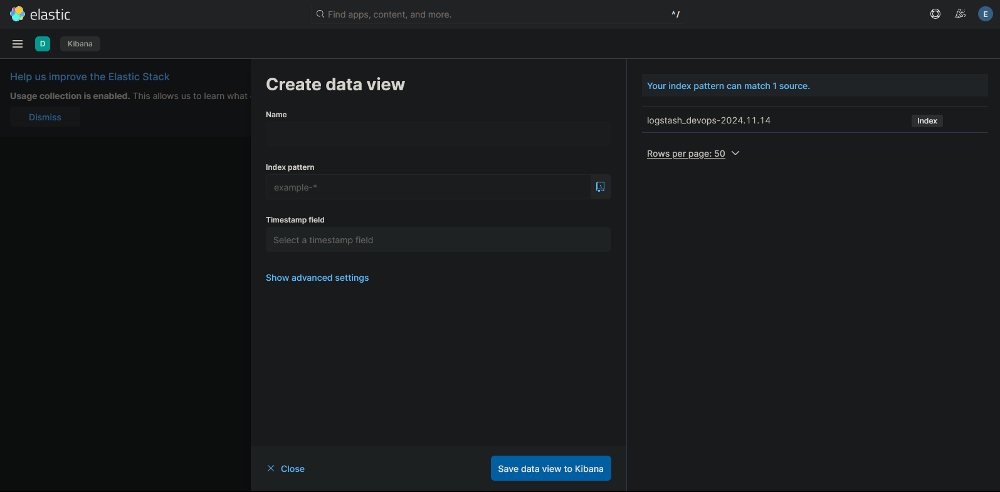
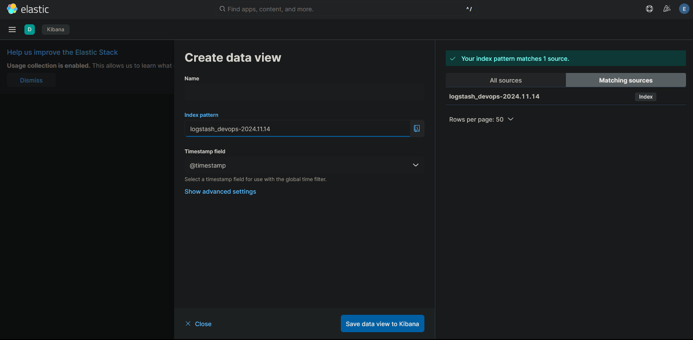
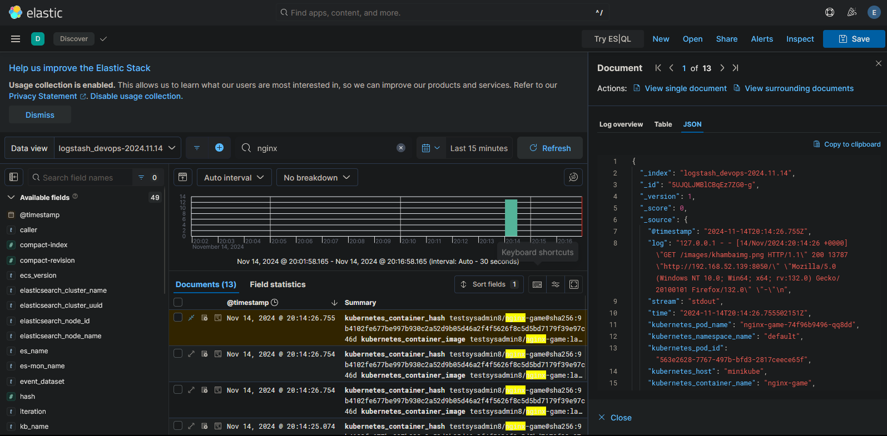
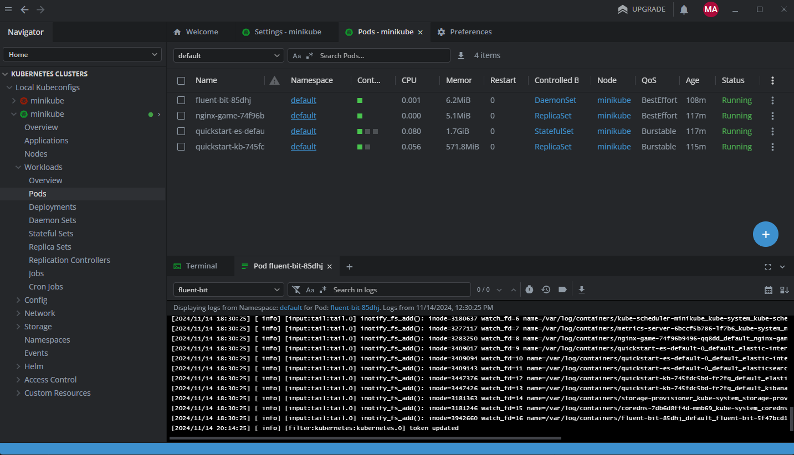

# Acceder a los Logs
Accedemos al panel por https://ip:5601 utiliza un certificado autofirmado aceptamos.

Nos autenticamos
- usuario: elastic
- Pass: kubectl get secret quickstart-es-elastic-user -o go-template='{{.data.elastic | base64decode}}'

Dentro del panel nos dirigimos al apartado Analytics / Discover 
Damos click sobre Create data view

Nos aparecera el logstash_devops-2024 este lo genero Fluentbit y es donde entregara los logs.
Rellenamos ese mismo nombre sobre el campo index pattern

En timestamp colocamos como la imagen y damos click en Save data view to kibana

Listo ya podremos hacer la busqueda de logs de pods, o recursos de kubernetes que hemos especificado.

En este caso son logs del juego flappybird, que aparecen por el nombre del pod.

Aqui se muestra como esta recibe y envia logs de fluentbit hacia elasticsearch

